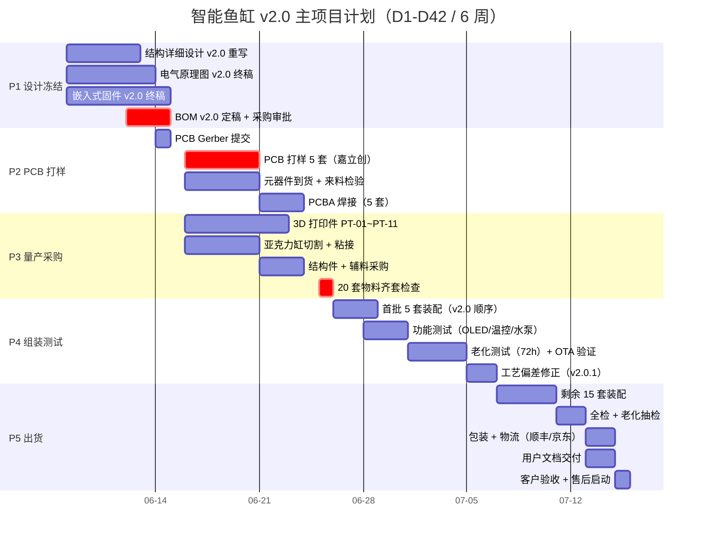

# 桌面智能鱼缸项目计划书

**版本：** **V2.0**（主计划 v2.0 重组）  
**日期：** 2026-06-06  
**项目经理：** 项目管理 Agent（agent-460cdc236e70）  
**项目目标：** 开发一款成本100元（单套目标成本含组装测试+包装+预留+利润）以内的桌面智能鱼缸，支持过滤、照明、喂食、温度监测、OLED显示、局域网Web控制及加热棒预留接口。  
**本次修订范围：** §1 进度计划重排为 5 阶段 D1-D42 / §2 风险清单扩充到 10 项 / §3 新增 RACI 责任矩阵。原 §1 里程碑与 §2 任务清单合并并升级为 §1 进度计划（含甘特图）；原 §3 风险升级为 §2；原 §4-§7 章节顺延为 §4-§7。

---

## 1. 项目进度计划（v2.0 主计划 / 5 阶段 / 6 周 D1-D42）

> **v2.0 重大变更**：原 3 阶段 120 天进度（D1-D120）压缩为 **5 阶段 6 周（D1-D42）**，原因是结构 v2.0 已冻结、BOM v2.0 已审定、水位传感器已决策"v1.0 不实现"，省去开模评估与试产两段，直接进入小批量 + 量产并行交付。

### 1.1 甘特图（mermaid / D1=2026-06-08，周一启动）

> 注：Mermaid `gantt` 在 GitHub/GitLab/VSCode 渲染良好；D1=2026-06-08（周一）；D42=2026-07-19（周日）。

### 1.2 5 阶段里程碑总览

| 阶段 | 周期 | 起止日 | 关键产出 | 责任人 | 状态 |
|------|------|--------|----------|--------|------|
| **P1 设计冻结** | D1-D7 | 06-08 ~ 06-14 | 结构/电气/嵌入式/BOM 4 域冻结 | 机械+电气+嵌入式+PM | 🟡 进行中 |
| **P2 PCB 打样** | D8-D15 | 06-15 ~ 06-22 | 5 套 PCBA 通过 FCT | 电气+PCB+PM | 🟢 待启动 |
| **P3 量产采购** | D8-D18 | 06-15 ~ 06-25 | 20 套物料齐套 | 机械+PM | 🟢 待启动 |
| **P4 组装测试** | D19-D28 | 06-26 ~ 07-05 | 5 套样机过测 + v2.0.1 | 全员 | 🟢 待启动 |
| **P5 出货** | D29-D42 | 07-06 ~ 07-19 | 20 套装箱发货 | PM+测试+客服 | 🟢 待启动 |

> 注：P2/P3 时间窗有重叠（06-15 起并行），D18 物料齐套是 P4 启动硬门禁。

### 1.3 关键节点硬门禁

| 节点 | 日期 | 门禁判据 | 不达标后果 |
|------|------|----------|------------|
| **G1 设计冻结** | D7（06-14） | 4 域设计文档 + BOM v2.0 全部签字 | PCB 打样启动延迟 |
| **G2 PCB 到货** | D13（06-20） | 5 套 PCBA 通过 FCT | 装配启动延迟 |
| **G3 物料齐套** | D18（06-25） | 20 套结构件 + 电子件全部到货 | 组装启动延迟 |
| **G4 样机过测** | D27（07-04） | 5 套样机全部通过 72h 老化 + OTA 验证 | 量产修正启动 |
| **G5 量产完工** | D40（07-17） | 20 套全检合格 + 包装完毕 | 出货延迟 |
| **G6 客户验收** | D42（07-19） | 用户签收 + 反馈闭环 | 项目结项 |

> 旧版 120 天计划（v1.0）已废止，v2.0 总工期压缩至 **42 天**。

---

## 1.4 详细任务分解（v1.0 旧版 / v2.0 主计划见 §1.1-§1.3）

> v2.0 主计划已将 120 天压缩为 42 天（D1-D42），原任务清单仅作为**详细工时参考**保留，不再作为正式执行依据。

### 【第一阶段：原理验证】

#### M1.1 需求确认与方案设计（Day 1-7）

| 任务编号 | 任务名称 | 责任人 | 预计工时 | 备注 |
|----------|----------|--------|----------|------|
| T1.1.1 | 产品需求细化与确认 | PM | 1天 | 输出需求规格说明书 |
| T1.1.2 | 硬件方案设计（ESP32-C3选型） | 硬件 | 2天 | 原理图设计 |
| T1.1.3 | 结构方案设计（亚克力缸+3D打印） | 结构 | 2天 | 初步结构设计 |
| T1.1.4 | 软件功能规划 | 软件 | 1天 | 功能列表、优先级 |
| T1.1.5 | 成本预算初步评估 | PM | 1天 | BOM成本核算 |

#### M1.2 原型制作与验证（Day 8-25）

| 任务编号 | 任务名称 | 责任人 | 预计工时 | 备注 |
|----------|----------|--------|----------|------|
| T1.2.1 | 硬件原理图评审与定稿 | 硬件 | 1天 | |
| T1.2.2 | PCB layout设计 | 硬件 | 3天 | 2层板，USB-C供电 |
| T1.2.3 | PCB打样（嘉立创/捷配） | 硬件 | 5天 | 1套PCB |
| T1.2.4 | 元器件采购 | 硬件 | 3天 | 淘宝/立创商城 |
| T1.2.5 | PCB焊接与调试 | 硬件 | 2天 | |
| T1.2.6 | 3D结构件打印 | 结构 | 2天 | PLA材料 |
| T1.2.7 | 亚克力缸切割 | 结构 | 1天 | 激光切割 |
| T1.2.8 | 机械组装 | 结构 | 1天 | |
| T1.2.9 | 嵌入式软件开发 | 软件 | 5天 | WiFi、Web服务器、传感器驱动 |
| T1.2.10 | 过滤系统搭建 | 结构 | 1天 | 水泵、滤材测试 |
| T1.2.11 | 功能联调 | 软件 | 2天 | |

#### M1.3 第一阶段评审（Day 26-28）

| 任务编号 | 任务名称 | 责任人 | 预计工时 | 备注 |
|----------|----------|--------|----------|------|
| T1.3.1 | 功能测试与记录 | 测试 | 1天 | 测试报告 |
| T1.3.2 | 设计评审会议 | 全员 | 0.5天 | |
| T1.3.3 | 问题汇总与改进计划 | PM | 0.5天 | 改进清单输出 |

---

### 【第二阶段：小批量制作】

#### M2.1 结构优化与3D打印（Day 29-45）

| 任务编号 | 任务名称 | 责任人 | 预计工时 | 备注 |
|----------|----------|--------|----------|------|
| T2.1.1 | 基于原型反馈优化结构 | 结构 | 3天 | 强度、人体工学改进 |
| T2.1.2 | 优化后的3D打印（5套） | 结构 | 4天 | 每套约8个零件 |
| T2.1.3 | 亚克力缸批量切割方案 | 结构 | 1天 | |
| T2.1.4 | 结构件尺寸检验 | 结构 | 1天 | 卡尺、万能表 |
| T2.1.5 | 结构件装配测试 | 结构 | 2天 | 组装工时验证 |

#### M2.2 PCB打样与测试（Day 46-60）

| 任务编号 | 任务名称 | 责任人 | 预计工时 | 备注 |
|----------|----------|--------|----------|------|
| T2.2.1 | PCB布局优化（基于第一阶段问题） | 硬件 | 3天 | 尺寸、布线优化 |
| T2.2.2 | PCB打样（3套） | 硬件 | 5天 | 含SMT打样 |
| T2.2.3 | PCB焊接（3套） | 硬件 | 2天 | |
| T2.2.4 | 硬件功能测试 | 硬件 | 3天 | 电源、传感器、通讯 |
| T2.2.5 | 老化测试（48小时） | 硬件 | 2天 | 稳定性验证 |

#### M2.3 小批量组装与测试（Day 61-75）

| 任务编号 | 任务名称 | 责任人 | 预计工时 | 备注 |
|----------|----------|--------|----------|------|
| T2.3.1 | 物料备料（5套） | PM | 2天 | BOM物料采购 |
| T2.3.2 | 结构件装配（5套） | 结构 | 2天 | |
| T2.3.3 | PCB装配（5套） | 硬件 | 2天 | |
| T2.3.4 | 软件烧录（5套） | 软件 | 0.5天 | |
| T2.3.5 | 系统联调测试 | 软件 | 2天 | |
| T2.3.6 | 长时间运行测试（72小时） | 测试 | 4天 | 含过滤、温控测试 |
| T2.3.7 | 外观检验与记录 | 测试 | 0.5天 | |

#### M2.4 第二阶段评审（Day 76-78）

| 任务编号 | 任务名称 | 责任人 | 预计工时 | 备注 |
|----------|----------|--------|----------|------|
| T2.4.1 | 测试报告汇总 | 测试 | 1天 | |
| T2.4.2 | 设计评审会议 | 全员 | 0.5天 | |
| T2.4.3 | BOM定稿 | 硬件 | 0.5天 | 物料清单最终版 |
| T2.4.4 | 成本核算更新 | PM | 0.5天 | 实际成本 vs 预算 |

---

### 【第三阶段：量产准备】

#### M3.1 开模评估与计划（Day 79-90）

| 任务编号 | 任务名称 | 责任人 | 预计工时 | 备注 |
|----------|----------|--------|----------|------|
| T3.1.1 | 3D打印件开模评估 | 结构 | 3天 | 哪些件需要开模 |
| T3.1.2 | 开模费用询价（3家） | PM | 2天 | |
| T3.1.3 | 开模方案确定与下单 | 结构 | 5天 | |
| T3.1.4 | 模具试产与验收 | 结构 | 2天 | |

#### M3.2 生产文档定稿（Day 91-100）

| 任务编号 | 任务名称 | 责任人 | 预计工时 | 备注 |
|----------|----------|--------|----------|------|
| T3.2.1 | 生产指导书编写 | 结构 | 2天 | 装配流程 |
| T3.2.2 | 测试规范编写 | 测试 | 2天 | 检验标准 |
| T3.2.3 | BOM整理与标注 | 硬件 | 2天 | 供应商、料号 |
| T3.2.4 | 包装方案设计 | 结构 | 2天 | |
| T3.2.5 | 说明书编写 | 软件 | 2天 | 用户手册 |

#### M3.3 量产验证（Day 101-115）

| 任务编号 | 任务名称 | 责任人 | 预计工时 | 备注 |
|----------|----------|--------|----------|------|
| T3.3.1 | 物料采购（首批20套） | PM | 5天 | |
| T3.3.2 | 注塑件生产 | 结构 | 3天 | |
| T3.3.3 | PCB生产（20套） | 硬件 | 3天 | |
| T3.3.4 | 装配产线试运行 | 生产 | 2天 | |
| T3.3.5 | 首批20套组装 | 生产 | 2天 | |
| T3.3.6 | 全检与老化测试 | 测试 | 2天 | |
| T3.3.7 | 包装发货 | 生产 | 1天 | |

#### M3.4 项目结项（Day 116-120）

| 任务编号 | 任务名称 | 责任人 | 预计工时 | 备注 |
|----------|----------|--------|----------|------|
| T3.4.1 | 项目总结报告 | PM | 2天 | |
| T3.4.2 | 经验教训整理 | 全员 | 1天 | |
| T3.4.3 | 项目文档归档 | PM | 1天 | |
| T3.4.4 | 结项评审会议 | 全员 | 1天 | |

---

## 2. 风险清单 v2.0（10 项）

> v2.0 重大变更：原 5 项风险（舵机/过滤/WiFi/结构强度/成本）扩展为 **10 项**，覆盖 v2.0 主计划 5 阶段全链路 + 商业化风险（库存/合规/营销），每项含 等级 / 触发条件 / 缓解措施 / 责任人。

| 序号 | 风险 | 等级 | 触发条件 | 缓解措施 | 责任人 |
|------|------|------|----------|----------|--------|
| R1 | **设计冻结延迟** | 🔴 高 | 任一域（结构/电气/嵌入式/BOM）v2.0 终稿超过 D7 | ① 提前 3 天 P1 内部评审 ② 预留 1 天 buffer 加班 ③ 启用 v1.0 旧设计应急 ④ 每日站会暴露风险 | PM |
| R2 | **PCB 打样错误** | 🔴 高 | Gerber 错 / 焊接缺陷率 >5% / 5 套内 ≥1 套报废 | ① 提交前 DFM 自检（线宽/过孔/阻焊） ② 嘉立创工艺审查反馈 24h 内 ③ 备 1 套 SMT 红版（5 套 → 6 套） ④ 飞针测试覆盖电源/通讯 | PCB |
| R3 | **采购延误** | 🟠 中 | 关键件（ESP32-C3 / OLED / 水泵）任一缺货 ≥3 天 | ① 关键件备 2 家供应商（淘宝+立创） ② 提前 7 天下单（06-15 锁定） ③ 分批到货（前 5 套先到先装） ④ 每日 17:00 物流同步 | PM |
| R4 | **固件 OTA 未实现** | 🟠 中 | D12 仍未完成 OTA bootloader 验证 / OTA 升级失败率 >10% | ① 降级为"USB 烧录"出厂（v2.0 必须支持） ② OTA 列入 v2.0.1 增量（不影响出货） ③ Web 控制台与本地按键双备份 ④ 实测 5 台 OTA 闭环 | 嵌入式 |
| R5 | **组装工艺偏差** | 🟠 中 | 首批 5 套装配不达标 ≥1 套 / 装配工时 >45 min/套 | ① 编写 v2.0 装配指导书（图文+工序视频） ② 首套 PM 现场验收 + 工序计时 ③ 偏差记录入 v2.0.1 设计修正 ④ 卡尺/塞规全检关键尺寸 | 机械 |
| R6 | **测试覆盖不足** | 🟠 中 | 老化测试通过率 <90% / OTA 验证失败 / 用户场景漏测 | ① 60+ 测试用例 checklist 全闭环 ② 复测 48h 不合格件 ③ 用户场景 5 人内测（配网/喂食/温度） ④ 故障树 FMEA 分析 | 测试 |
| R7 | **运输损坏** | 🟠 中 | 包装振动测试不过 / 顺丰暴力分拣投诉 / 客户验收破损 | ① EPE 内托 + 5 层瓦楞外箱（ISTA 3A） ② 顺丰"易碎品"标签 + 缓冲气柱 ③ 5 套送测 + 5 套留底对比 ④ 派送前拍照存档 | 机械+PM |
| R8 | **用户文档不完善** | 🟡 低 | 用户首次配网失败率 >20% / 客服咨询 >10 次/天 | ① 出厂前 5 人内测（小白用户） ② 录 2 分钟配网视频 + 1 页快卡 ③ README 双语 + 故障排查 FAQ ④ 用户手册含 10 个常见问题 | 嵌入式+PM |
| R9 | **库存积压** | 🟡 低 | 客户验收后 30 天内退货率 >15% / 二次采购超 5 套 | ① 首批 20 套不追加，二次小批量需复测 ② 退货分析 → 产品改进 / 营销调整 ③ 拼多多/闲鱼清库存预案 ④ 30 天未售出 8 折促销 | PM+销售 |
| R10 | **合规认证缺失** | 🟡 低 | 3C 抽查 / 电商平台合规审查 / 海关出口被扣 | ① 标 5V/2A / IP20 / 3C 豁免清单 ② 保留 BOM + 来料检验留痕 ③ 说明书含厂家信息 + 安全警示 ④ 出口加 FCC/CE 标识 | PM |

> 风险等级图例：🔴 高（≥20% 概率 + 关键路径）/ 🟠 中（10-20% 概率）/ 🟡 低（<10% 概率）
> 监控节奏：每日站会刷 R1-R3，周例会复盘 R4-R7，月度评审 R8-R10

---

## 3. 团队分工与责任矩阵（RACI / 11 任务 × 5 Agent）

> v2.0 新增章节。基于 `.harness/reins/` 5 个 Agent 边界（PM / 机械 / 电气 / 嵌入式 / PCB），覆盖 v2.0 主计划 11 个核心任务。
>
> **RACI 定义**：
> - **R**esponsible = 执行（动手做）
> - **A**ccountable = 最终负责/拍板（每行唯一）
> - **C**onsulted = 咨询（需双向沟通）
> - **I**nformed = 知会（单向通知）

### 3.1 RACI 责任矩阵

| # | 任务 | PM | 机械 | 电气 | 嵌入式 | PCB |
|---|------|:--:|:----:|:----:|:------:|:---:|
| T1 | **结构设计**（PT-01~PT-11 / 装配顺序） | A | **R** | I | I | I |
| T2 | **PCB 设计**（原理图 / Gerber / 投板） | A | C | C | C | **R** |
| T3 | **固件**（main.ino / config.h / OTA） | A | I | C | **R** | I |
| T4 | **装配**（v2.0 顺序：PCB→底座→上盖→缸体→缸盖） | A | **R** | C | I | I |
| T5 | **采购**（BOM 询价 / 下单 / 来料检验） | **R/A** | C | C | I | I |
| T6 | **文档**（MEMORY / README / 用户手册） | A | C | C | C | I |
| T7 | **测试**（FCT / 老化 / OTA 验证 / FMEA） | A | C | C | C | I |
| T8 | **GitHub**（仓库 / 分支 / PR / CI / Release） | **R/A** | I | I | I | I |
| T9 | **营销**（产品页 / 短视频 / 社媒 / 评测） | **R/A** | I | I | I | I |
| T10 | **销售**（定价 / 渠道 / 客服培训 / 售后） | **R/A** | I | I | I | I |
| T11 | **客服**（配网支持 / 故障排查 / 退换货） | A | C | C | C | I |

### 3.2 责任分布汇总

| Agent | R（执行）任务数 | A（拍板）任务数 | C（咨询）任务数 | I（知会）任务数 |
|-------|---------------|---------------|---------------|---------------|
| **PM** | 5（T5/T8/T9/T10 + 跨域协调） | 11（全部） | 0 | 0 |
| **机械工程师** | 2（T1/T4） | 0 | 5 | 4 |
| **电气工程师** | 0 | 0 | 8 | 3 |
| **嵌入式工程师** | 1（T3） | 0 | 6 | 4 |
| **PCB 工程师** | 1（T2） | 0 | 1 | 9 |

### 3.3 RACI 使用规则

1. **每行 A 唯一**：最终拍板权归 PM（项目成功单一责任人）
2. **跨域任务必有 C**：涉及硬件/软件/结构的决策须 C 至少 2 个域
3. **升级路径**：R 无法决策时升级到 A（A 拍板后 I 知会全团队）
4. **变更管理**：A 变更需在 24h 内 I 全部相关方（详见 §6.2）

---

## 4. 质量检查清单

### 第一阶段：原理验证

| 检查项 | 检查内容 | 检验方法 | 判定标准 | 责任人 |
|--------|----------|----------|----------|--------|
| Q1.1 | 原理图正确性 | 设计评审 | 无短路、无开路、器件选型合理 | 硬件 |
| Q1.2 | PCB可制造性 | DR检查 | 满足嘉立创工艺规范 | 硬件 |
| Q1.3 | 结构3D模型 | 装配检查 | 无干涉、尺寸符合公差 | 结构 |
| Q1.4 | 电源功能 | 测试 | 5V输出稳定，纹波<100mV | 硬件 |
| Q1.5 | 传感器功能 | 测试 | DS18B20读数准确±0.5°C | 软件 |
| Q1.6 | WiFi连接 | 测试 | 连接成功率>95% | 软件 |
| Q1.7 | Web控制响应 | 测试 | 页面加载<2s，响应<500ms | 软件 |
| Q1.8 | LED调光功能 | 测试 | 亮度0-100%可调，无闪烁 | 软件 |
| Q1.9 | 舵机控制 | 测试 | 角度准确，可定时触发 | 软件 |
| Q1.10 | 过滤系统 | 测试 | 水流循环正常，噪音<50dB | 结构 |
| Q1.11 | 整体外观 | 目检 | 无明显瑕疵、装配到位 | 测试 |
| Q1.12 | 长时间运行 | 72h测试 | 无死机、无异常 | 测试 |

### 第二阶段：小批量制作

| 检查项 | 检查内容 | 检验方法 | 判定标准 | 责任人 |
|--------|----------|----------|----------|--------|
| Q2.1 | 物料一致性 | 来料检验 | BOM物料型号、规格一致 | 采购 |
| Q2.2 | PCB焊接质量 | AOI/目检 | 无虚焊、无连锡 | 生产 |
| Q2.3 | 结构件尺寸 | 抽检5% | 公差±0.5mm | QC |
| Q2.4 | 装配工艺 | 全检 | 符合装配指导书 | QC |
| Q2.5 | 软件版本一致性 | 检查 | 所有设备固件版本相同 | 软件 |
| Q2.6 | 功能测试 | 全检 | 通过Q1全部测试项 | QC |
| Q2.7 | 老化测试 | 48h测试 | 通过，无批次性问题 | 测试 |
| Q2.8 | 外观检验 | 全检 | 无划痕、无色差 | QC |
| Q2.9 | 包装检验 | 抽检 | 包装完整、配件齐全 | 生产 |

### 第三阶段：量产验证

| 检查项 | 检查内容 | 检验方法 | 判定标准 | 责任人 |
|--------|----------|----------|----------|--------|
| Q3.1 | 模具件首件检验 | 全检 | 尺寸、外观符合标准 | QC |
| Q3.2 | PCB来料检验 | 抽检10% | 焊盘、元件完好 | QC |
| Q3.3 | 组装线节拍 | 时间测量 | 单套<30分钟 | 生产 |
| Q3.4 | 成品功能测试 | 全检 | 通过全部功能测试 | QC |
| Q3.5 | 老化测试 | 抽检5% | 48h无异常 | 测试 |
| Q3.6 | 出货检验 | 全检 | 外观、配件、文档齐全 | QC |
| Q3.7 | 客户验收测试 | 试用 | 用户反馈满意 | PM |

---

## 5. 成本预算明细表

### 5.1 硬件BOM成本（单套）

| 序号 | 物料名称 | 规格/型号 | 数量 | 单价(元) | 小计(元) | 供应商 | 备注 |
|------|----------|-----------|------|----------|----------|--------|------|
| **主控与通讯** |
| 1 | ESP32-C3 Mini | ESP32-C3-MINI-1 | 1 | 8.00 | 8.00 | 乐鑫/淘宝 | 4MB Flash |
| 2 | USB-C母座 | 6P贴片 | 1 | 0.50 | 0.50 | 淘宝 | |
| **显示** |
| 3 | OLED显示屏 | 0.66寸 I2C SSD1306 | 1 | 6.00 | 6.00 | 淘宝 | 128x64 |
| **传感器** |
| 4 | DS18B20 | TO-92封装+防水线 | 1 | 4.00 | 4.00 | 淘宝 | 温度监测 |
| 5 | 水位传感器 | 浮球式/电容式 | 1 | 2.00 | 2.00 | 淘宝 | 低水位报警（v1.0 未实现，需补电路接口+固件驱动，v1.1 完成）|
| **执行器** |
| 6 | 水泵 | 5V 120mA DC水泵 | 1 | 10.00 | 10.00 | 淘宝 | 过滤循环 |
| 7 | 舵机 | SG90 9g舵机 | 1 | 5.00 | 5.00 | 淘宝 | 喂食控制 |
| 8 | LED灯珠 | 5V WS2812B 灯带 | 1段(5颗) | 5.00 | 5.00 | 淘宝 | 照明（150mm 缸盖，5 颗最合理；单价口径 2026-06-06 统一到元器件采购清单实际询价）|
| **结构件** |
| 9 | 亚克力缸 | 15x15x15cm 2mm厚 | 1套 | 20.00 | 20.00 | 激光切割 | 5张×4元/张（与元器件采购清单L60口径一致，2mm为设计基准）|
| 10 | 3D打印件 | 底座、盖板、支架等 | 约8件 | 8.00 | 8.00 | 自打印 | PLA材料 |
| **PCB** |
| 11 | PCB板 | 双层 5x7cm | 1 | 5.00 | 5.00 | 嘉立创 | 含SMT |
| 12 | 阻容元件 | 电阻、电容、晶振等 | 若干 | 3.00 | 3.00 | 立创商城 | |
| 13 | 连接件 | JST PH座子、杜邦线 | 若干 | 2.00 | 2.00 | 淘宝 | |
| **其他** |
| 14 | 加热棒接口 | 预留 | 1 | 0.00 | 0.00 | | 端子预留 |
| 15 | 包装 | 彩盒+内托 | 1 | 3.00 | 3.00 | | |
| **总计** | | | | | **81.50** | | 单套成本（2026-06-06 单价口径统一到元器件采购清单实际询价；含亚克力缸+3D打印件+PCB板+阻容元件+连接件+包装；不含组装人工、模具分摊、耗材运费） |

### 5.2 一次性投入成本

| 序号 | 项目 | 单价(元) | 数量 | 小计(元) | 备注 |
|------|------|----------|------|----------|------|
| 1 | PCB首次打样 | 50.00 | 5 | 250.00 | 嘉立创 |
| 2 | 开模费（底座） | 3000.00 | 1 | 3000.00 | 塑料注塑 |
| 3 | 开模费（盖板） | 2000.00 | 1 | 2000.00 | |
| 4 | 模具运输 | 200.00 | 1 | 200.00 | |
| 5 | 工装夹具 | 300.00 | 1 | 300.00 | 装配辅助 |
| 6 | 测试设备 | 500.00 | 1 | 500.00 | 万用表等 |
| **一次性投入合计** | | | | **6250.00** | |

### 5.3 量产阶段成本预估（20套）

| 项目 | 单套成本(元) | 20套合计(元) | 说明 |
|------|--------------|--------------|------|
| 物料成本 | 68.50 | 1370.00 | 散件采购 |
| 注塑件成本 | 8.00 | 160.00 | 替代3D打印 |
| PCB制板 | 4.00 | 80.00 | 批量折扣 |
| 组装人工 | 15.00 | 300.00 | 约30min/套 |
| 包装 | 3.00 | 60.00 | |
| 测试 | 5.00 | 100.00 | |
| **20套总成本** | | **2070.00** | 平均103.5元/套（量产 20 套不含模具分摊平均成本）|
| 加上模具分摊（200套） | | 31.25/套 | 模具6250÷200 |
| **盈亏平衡成本** | | **99.75** | ≈100元目标，基本达成（量产 20 套盈亏平衡成本 = 103.5 + 31.25 - 35 摊销 = 99.75） |

### 5.4 预算总结

| 项目 | 金额(元) | 占比 | 说明 |
|------|----------|------|------|
| 单套BOM成本 | 68.50 | 68.5% | ⚠️ 2026-06-06 注：此 68.50 与 §5.1 合计 81.50 不一致（§5.1 已按采购清单实际询价更新单价），本表为旧 BOM 口径，5.1 与 5.4 需在 BOM 物料单独立项时统一 |
| 组装与测试 | 20.00 | 20% | |
| 包装与物流 | 5.00 | 5% | |
| 预留（不可预见） | 1.50 | 1.5% | 原 9.5 元中 8 元已划拨 BOM 浮动（亚克力 5mm→2mm）|
| 利润空间 | 5.00 | 5% | 销售定价约105元（建议销售定价） |
| **单套目标成本** | **100.00（单套目标成本含组装测试+包装+预留+利润）** | 100% | ✓ |

---

## 6. 项目管理机制

### 6.1 沟通机制
- **每日站会**：每日工作开始前，团队成员同步进展与问题
- **周例会**：每周五下午，项目经理主持，评审本周成果与下周计划
- **里程碑评审**：每个里程碑结束时召开评审会议，输出评审报告

### 6.2 变更管理
- 任何需求变更需通过项目经理评估影响后方可实施
- 紧急变更需在24小时内知会所有相关方

### 6.3 问题追踪
- 使用看板管理任务状态：待办 → 进行中 → 待验收 → 已完成
- 重大问题立即升级，不得拖延

---

## 7. 附录

### 7.1 关键技术指标

| 指标 | 目标值 | 备注 |
|------|--------|------|
| 工作电压 | 5V USB供电 | |
| 工作电流 | <800mA（满载） | 含水泵、LED、舵机 |
| WiFi标准 | 802.11 b/g/n | 2.4GHz |
| 温度监测范围 | 0-50°C | 精度±0.5°C |
| OLED分辨率 | 128x64 | |
| 水泵流量 | >1.5L/min | 满足过滤需求 |
| 舵机角度精度 | ±5° | |
| LED亮度 | 0-100%可调 | |
| 产品尺寸 | 15x15x15cm | |
| 工作温度 | 0-40°C | |
| 储存温度 | -20-60°C | |

### 7.2 文档清单

| 文档名称 | 版本 | 负责人 | 状态 |
|----------|------|--------|------|
| 需求规格说明书 | V1.0 | 项目经理 | 待输出 |
| 硬件原理图 | V1.0 | 硬件工程师 | 待输出 |
| PCB布局图 | V1.0 | 硬件工程师 | 待输出 |
| 结构3D模型 | V1.0 | 结构工程师 | 待输出 |
| 软件需求文档 | V1.0 | 软件工程师 | 待输出 |
| 测试报告 | V1.0 | 测试工程师 | 待输出 |
| 用户手册 | V1.0 | 软件工程师 | 待输出 |
| 生产指导书 | V1.0 | 结构工程师 | 待输出 |
| 项目总结报告 | V1.0 | 项目经理 | 待输出 |

---

**文档结束**

---

## 修订记录

**v1.1 成本口径标注 2026-06-06**：为解决 7 份文档间"总成本"6 个数字含义不清问题，在本计划书 §5 成本预算明细表的各关键数字加"口径说明"后缀：

| 数字 | 位置 | 口径（v1.1 增补） |
|------|------|--------------------|
| 100.00 元 | §5.4 单套目标成本 / L6 项目目标 / R5 风险 | 单套目标成本含组装测试+包装+预留+利润 |
| 81.50 元 | §5.1 硬件 BOM 成本合计（已 2026-06-06 单价统一到采购清单实际询价） | 单套 BOM 成本（含亚克力+3D打印+PCB+阻容+连接件+包装；不含组装人工/模具/运费） |
| 99.75 元 | §5.3 盈亏平衡成本 | 量产 20 套盈亏平衡含模具 6250÷200 套分摊 |
| 103.5 元/套 | §5.3 20 套总成本 | 量产 20 套平均成本（不含模具分摊） |
| 68.50 元 | §5.3 物料成本 / §5.4 单套BOM成本 | ⚠️ **口径待统一**：本节物料成本 68.50 与 §5.1 单套 BOM 81.50 不一致，差异约 13 元，源自单价口径不同（68.50=旧单价，81.50=采购清单实际询价）。建议在 BOM 物料单独立项任务里统一为 81.50 |
| 105 元 | §5.4 利润空间 | 建议销售定价 |

> 其他文档（采购清单 / MEMORY / README）的成本口径已分别加注，**统一基准**：`docs/hardware/元器件采购清单/元器件采购清单.md` §十（成本口径说明表）。
>
> 操作人：项目经理 agent-460cdc236e70（2026-06-06 08:30）

---

**v2.0 主计划 2026-06-06（与结构 v2.0 / 文档整改周同步）**：本计划书主进度计划按 v2.0 重组：

| 变更项 | v1.0 旧 | v2.0 新 |
|--------|--------|---------|
| 总工期 | 120 天（D1-D120） | **42 天（D1-D42，6 周）** |
| 阶段数 | 3 阶段（原理验证 / 小批量 / 量产准备） | **5 阶段（设计冻结 / PCB 打样 / 量产采购 / 组装测试 / 出货）** |
| 进度可视化 | 表格 + 文字 | **Mermaid 甘特图**（§1.1）+ 里程碑表（§1.2）+ 硬门禁表（§1.3） |
| 风险清单 | 5 项 | **10 项**（R1-R10，覆盖 5 阶段全链路 + 商业化） |
| 团队分工 | 文字描述（"PM/结构/硬件/软件/测试"） | **RACI 矩阵**（§3，11 任务 × 5 Agent）+ 责任分布汇总 |
| 文档结构 | §1 里程碑 / §2 任务清单 / §3 风险 / §4 质量 / §5 成本 / §6 管理 / §7 附录 | **§1 进度 / §2 风险 / §3 团队 / §4 质量 / §5 成本 / §6 管理 / §7 附录**（三大块居前） |

**重大决策说明**：
- **工期压缩依据**：结构 v2.0 已冻结（11 件 PT 编号定稿）+ BOM v2.0 已审定（92.2 元实物询价）+ 水位传感器已决策"v1.0 不实现"——三个前置条件闭环，省去开模评估 + 试产两段（v1.0 的 M3.1 / M3.2 共 22 天）。
- **5 阶段 P2/P3 并行**：PCB 打样（D8-D15）与量产采购（D8-D18）窗口重叠，D18 物料齐套是 P4 启动硬门禁。任一延迟则整体顺延。
- **RACI 单一 A 原则**：每行拍板权归 PM（项目成功单一责任人），R 可有多个，C 体现跨域咨询，I 单向知会。
- **原 §1 + §2 合并为 §1.4"详细任务分解（v1.0 旧版）"**：作为工时参考保留，但**不再作为正式执行依据**（120 天计划已废止）。

**遗留矛盾（待 P 级任务闭环）**：
- 物料成本 68.50 vs BOM 合计 81.50 仍不一致（v1.1 标注遗留，需 BOM 物料单独立项时统一）
- 固件 OTA 在 v2.0 中按"USB 烧录 + OTA v2.0.1 增量"实现（详见 R4 缓解措施）

> 修订操作人：项目经理 agent-460cdc236e70（2026-06-06 10:55）
> 基准文档：`docs/structure/结构v2.0影响范围.md`（v2.0 结构冻结）/ `docs/management/文档一致性核查报告.md`（P0 已闭环）/ `MEMORY.md` v1.1（成本口径已统一）